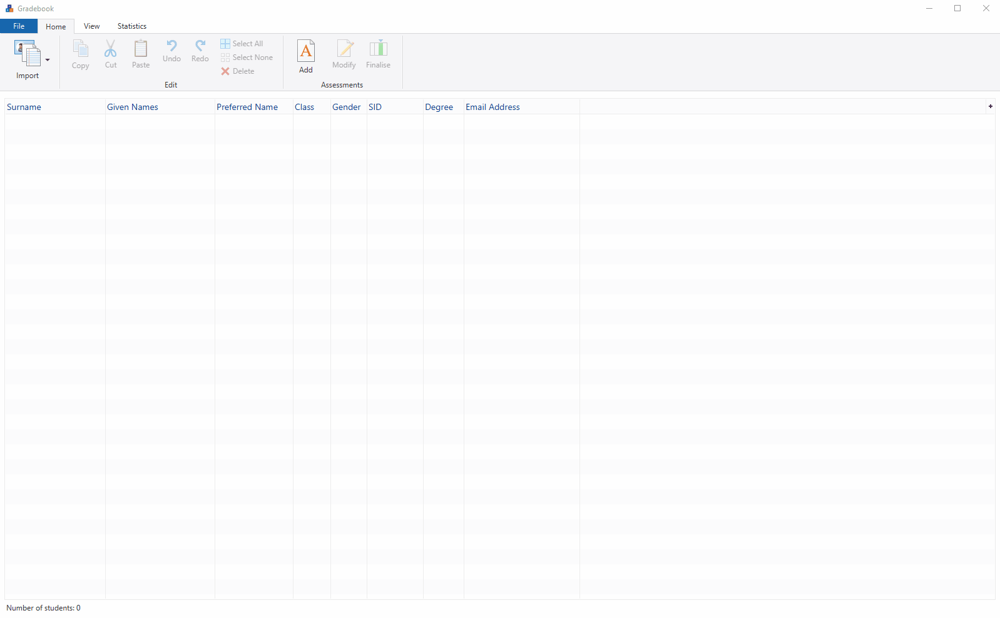
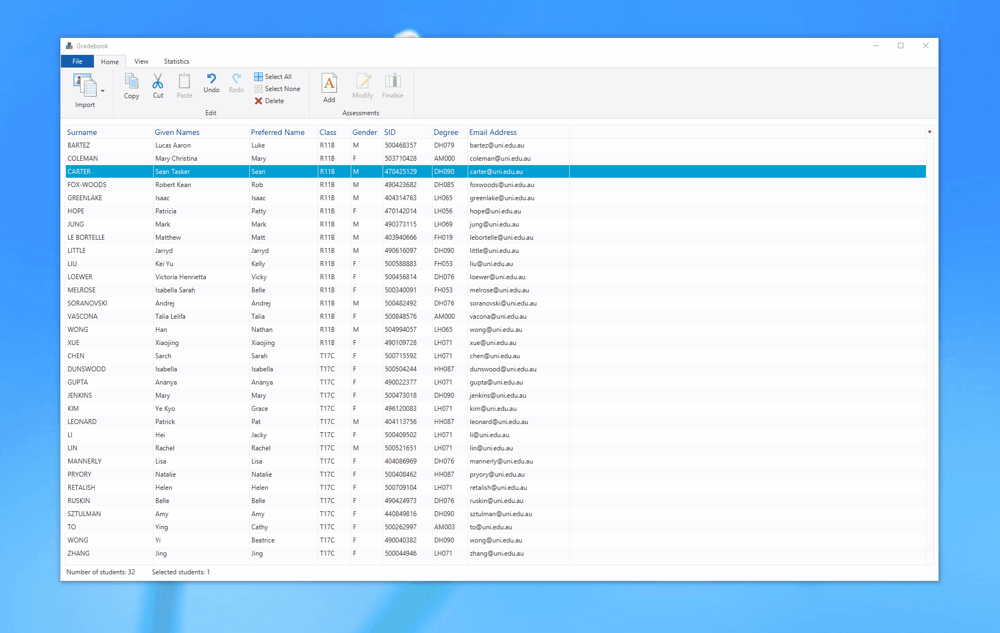
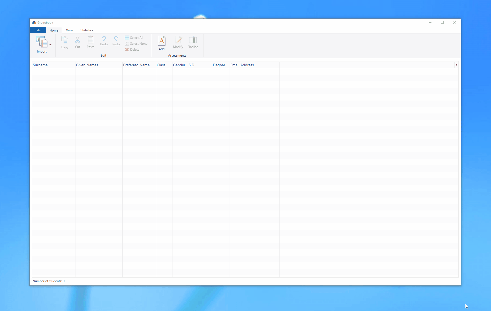
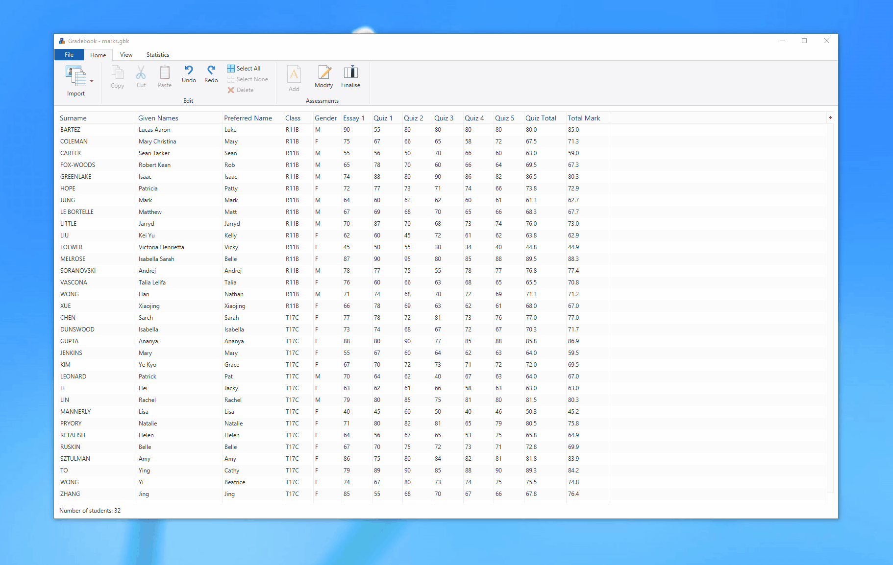

# Gradebook v.0.81
## Manage Student Info and Grades
*This gradebook application is an ongoing personal project and not intended for commercial use. I have used Microsoft Windows 10 icons and styling as a learning tool to practice JavaFX CSS and FXML/Scenebuilder. I do not own the rights to the icons, so if you would like to use the software for yourself, please replace them with your own first.*

You can download and try it here: https://github.com/fugu137/gradebook/releases/download/v0.9.0/gradebook.exe.

Gradebook was made using JavaFX, as both an application I can use in my teaching, and as a project to practice Java and to learn JavaFX. It uses the Command Pattern to implement undo/redo functionality, SceneBuilder and JavaFX CSS to mimic the UI from Windows 10 Explorer, and makes use of many of JavaFX's features(e.g., TableView, ComboBox, CheckBox, MenuButton, ToggleButton, BarChart, PieChart). 

### Import student details from class rolls or enter them manually:

### Add single assessments (with weighted grades) or sets of assessments (graded by the best *n* of *m* assessments):

### Load, save, cut, copy, paste, delete, undo, redo, filter, sort:

### View grade statistics (updated in real-time):

